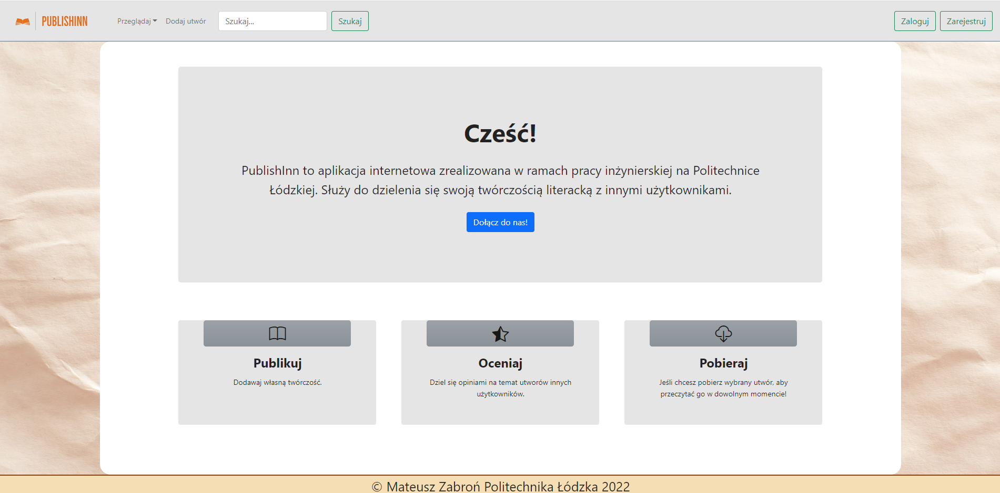
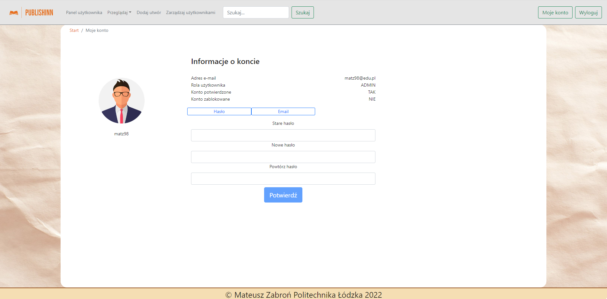
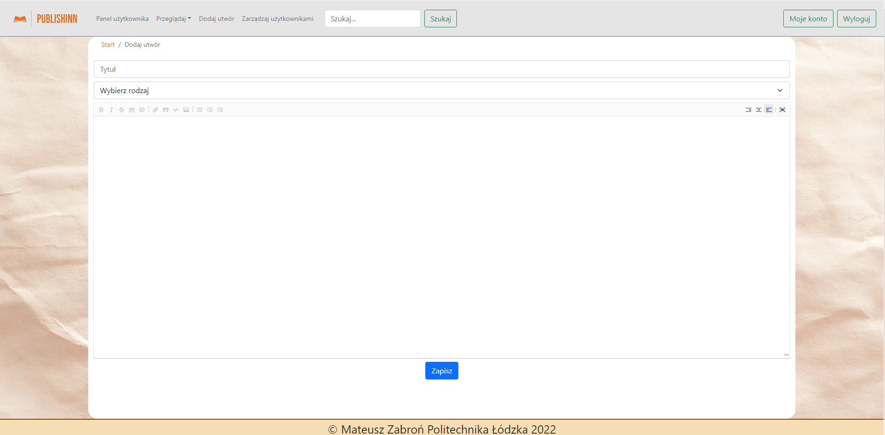
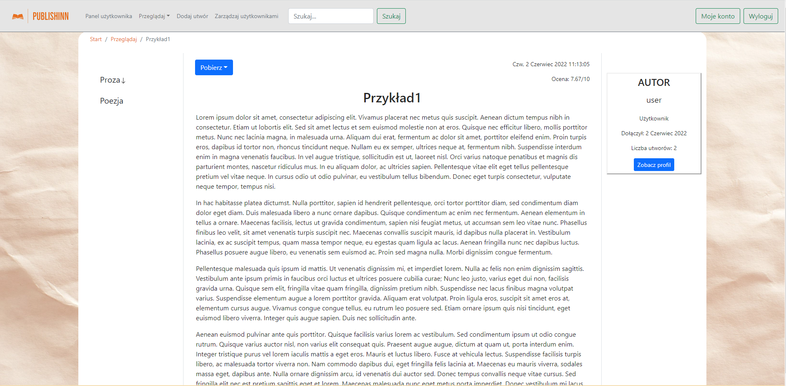
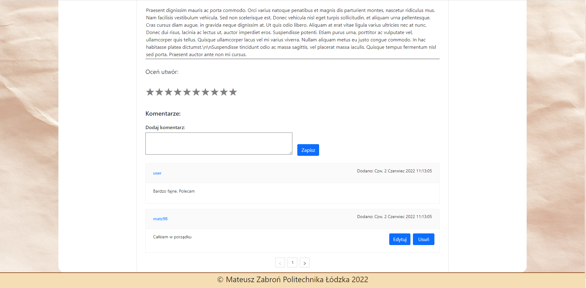
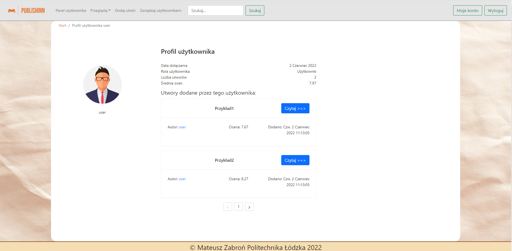

# PublishInn

## (PL)
Aplikacja webowa umożliwiająca publikowanie, czytanie oraz ocenianie amatorskich utworów literackich. Projekt został
zrealizowany w ramach pracy inżynierskiej na Politechnice Łódzkiej.

## (EN)
Web application allowing to publish, read and rate amateur literary works. Project has been carried out as part of an
engineering thesis at the Lodz University of Technology.

## Stos technologiczny / Technological stack
- OpenJDK 17.0.1
- Spring Framework 5.3.12
- Spring Boot 2.5.6
- Apache Maven 3.6.3
- react.js 17.0.2
- Bootstrap 5.1.3
- Antd 4.18.2
- Hibernate 5.4.32.Final
- H2 1.4.200
- PostgreSQL 13.3
- JUnit 5.7.2
- REST Assured 4.3.3
- Lombok 1.18.22
- MapStruct 1.4.2.Final

## Zrzuty ekranu prezentujące aplikację / Screenshots presenting the application

###

###

###

###

###
